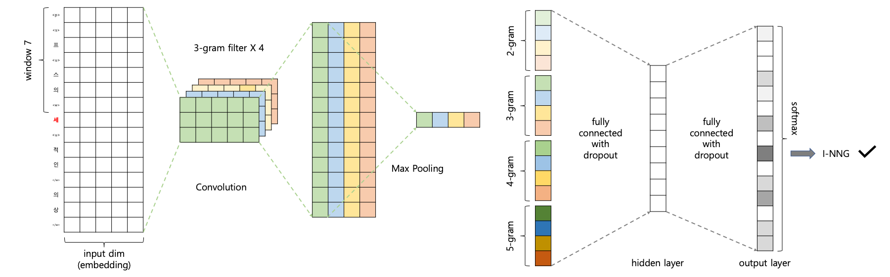

CNN 모델
====

음절 기반 모델
----
한국어 형태소 분석 결과는 원형 복원, 불규칙 활용 등의 이유로 입력 문자와는 형태와 길이가 달라지게 됩니다. 예를 들어, `져줄래`와 같은 입력 어절의 분석 결과는 `지/VV + 어/EC + 주/VX + ㄹ래/EF`와 같이 출력의 길이와 형태 모두 쉽게 예측이 가능하지 않습니다. 이러한 길이의 불일치 문제로 인해 기계학습 분류기에 기반한 모델의 출력을 설계하는 부분이 중요합니다.

기존에 고전적인 HMM, CRF 등의 방법에서는 TRIE 사전을 이용하여 들쑥날쑥한 형태의 lattice 격자를 Viterbi 알고리즘을 통해 최적의 경로를 탐색하는 형식으로 많이 접근해 왔습니다.

최근의 딥러닝 방법으로는 번역에서 많이 사용하는 sequence to sequence(seq2seq) 방식을 맨 먼저 생각해 볼 수 있습니다. `져, 줄, 래`라는 입력 원문에 대해 인코더를 통해 latent 벡터를 생성하고 `지/VV, 어/EC, 주/VX, ㄹ래/EF`라는 출력을 디코더를 통해 차례로 생성하는 것입니다. 여기에 당연히 attention 메커니즘을 적용할 수 있겠습니다. 그러나 seq2seq 방식에서 주로 사용하는 Recurrent Neural Network(RNN)은 속도가 느리고, 입력 음절과 출력 형태소 간의 연결 정보가 끊어져 형태소 분석 결과가 입력의 어느 부분으로부터 나왔는지 정보가 소실되는 단점이 있습니다.

이에 khaiii는 입력된 각 음절에 대해 하나의 출력 태그를 결정하는 분류 문제로 접근합니다.


음절과 형태소의 정렬
----
입력의 경우 각각의 음절이 분류 대상입니다. 형태소 분석 결과는 다시 형태소 각각의 음절 별로 나누어 IOB1 방식으로 표현하면 다음과 같습니다. \[참고: Tjong Kim Sang 1999\]

```
입력: 심사숙고했겠지만
분석: 심사/NNG + 숙고/NNG + 하/VX + 였/EP + 겠/EP + 지만/EC
태그: 심/I-NNG, 사/I-NNG, 숙/B-NNG, 고/I-NNG, 하/I-VX, 였/I-EP, 겠/B-EP, 지/I-EC, 만/I-EC
```

각각의 음절들은 아래와 같이 정렬이 됩니다.

음절 (입력) | 분석 결과 | 태그 (출력)
----------|-----|---------
심 | 심/I-NNG | I-NNG
사 | 사/I-NNG | I-NNG
숙 | 숙/B-NNG | B-NNG
고 | 고/I-NNG | I-NNG
했 | 하/I-VX, 였/I-EP | I-VX:I-EP:0
겠 | 겠/B-EP | B-EP
지 | 지/I-EC | I-EC
만 | 만/I-EC | I-EC

`했`은 `I-VX:I-EP:0`라는 복합 태그를 갖는 반면, 나머지 음절들은 단순 태그를 갖습니다. 복합 태그와 단순 태그의 차이는 원형복원 사전의 사용 여부와 관련이 있습니다. 음절과 복합 태그를 합친 `했/I-VX:I-EP:0`를 key로 하여 원형복원 사전을 검색하면 `하/I-VX, 였/I-EP`이라는 복원 정보를 얻게 됩니다.

이렇게 음절과 형태소를 정렬하고 태그로부터 원형을 복원하는 방식은 심광섭 교수님의 논문에서 기본적인 아이디어를 차용했습니다. \[참고: 심광섭 2013\]

코퍼스에서 모든 음절에 대해 형태소 분석 결과와 정렬을 수행하고 필요한 경우 복합 태그를 `I-VX:I-EP:1`, `I-VX:I-EP:2`와 같이 순차적으로 생성한 다음 자동으로 원형 복원 사전도 생성하게 됩니다. 아래는 이렇게 생성된 학습 데이터의 예시입니다.

```
프랑스의	I-NNP I-NNP I-NNP I-JKG
세계적인	I-NNG I-NNG I-XSN I-VCP:I-ETM:0
의상	I-NNG I-NNG
디자이너	I-NNG I-NNG I-NNG I-NNG
엠마누엘	I-NNP I-NNP I-NNP I-NNP
웅가로가	I-NNP I-NNP I-NNP I-JKS
실내	I-NNG I-NNG
장식용	I-NNG I-NNG I-XSN
직물	I-NNG I-NNG
디자이너로	I-NNG I-NNG I-NNG I-NNG I-JKB
나섰다.	I-VV I-VV:I-EP:0 I-EF I-SF
```

그리고 아래는 동시에 자동으로 생성된 원형복원 사전입니다.

```
인/I-VCP:I-ETM:0	이/I-VCP ㄴ/I-ETM
섰/I-VV:I-EP:0	서/I-VV 었/I-EP
```

이렇게 모든 코퍼스 내 어절의 정렬을 마치고 나면 92개의 고정된 단순 태그와 400여 개의 복합 태그가 생성됩니다. 이때 정렬은 수작업으로 작성한 규칙과 매핑 사전을 사용해 자동으로 정렬을 수행하고, 정렬에 실패한 문장은 학습에서 제외했습니다. 그러면 비로소 각각의 입력 음절에 대해 500여 개의 출력 태그를 판단하는 분류 문제로 접근할 수 있게 됩니다.


윈도우와 문맥
----
하나의 음절에 대해 태그를 판단하기 위해 윈도우 크기만큼 좌/우로 확장한 문맥을 사용합니다. 예를 들어 `프랑스의 세계적인 의상 디자이너 엠마누엘 ...`라는 입력에 대해 `세`라는 음절의 태그를 판단하기 위해 윈도우 크기가 7인 문맥은 아래와 같습니다.

-7 | -6 | -5 | -4 | -3 | -2 | -1 | 0 | 1 | 2 | 3 | 4 | 5 | 6 | 7
---|----|----|----|----|----|----|---|---|---|---|---|---|---|---
\<p> | \<s> | 프 | \<u> | 스 | 의 | \<w> | __세__ | \<u> | 적 | 인 | \</w> | 의 | 상 | \</w>

실질적인 음절 이외에 가상의 음절들도 문맥으로 사용하는데요 아래와 같습니다.

가상 음절 | 의미
--------|----
\<u> | Out of Vocabulary 음절
\<w> | 왼쪽 어절 경계 (공백)
\</w> | 오른쪽 어절 경계 (공백)
\<s> | 문장의 처음
\</s> | 문장의 끝
\<p> | 패딩 (문맥이 모자랄 경우)


네트워크 구조
----


위 네트워크는 윈도우가 7이고 음절의 임베딩 크기는 5, 커널의 크기가 3인 4개의 필터를 사용한 convolution입니다. 크기가 \[15, 5\]인 문맥을 하나의 필터를 거치면 길이가 13인 하나의 벡터가 생성되고 전체에 대해 max pooling을 적용하면 하나의 스칼라 값이 됩니다. 4개의 필터를 사용했으므로 최종적으로 길이가 4인 벡터가 나오게 됩니다.

이런 방식으로 커널의 크기가 {2, 3, 4, 5}에 대해 각각 길이가 4인 벡터를 연결하여 길이가 16인 벡터를 생성합니다. 이것을 hidden 레이어와 출력 레이어를 거쳐 최종적으로 태그를 결정하게 됩니다.

실제로 base 모델의 경우 윈도우 크기가 3, 임베딩 크기는 30입니다. 필터의 출력 차원은 임베딩과 같이 30을 사용했고, {2, 3, 4, 5} 네 종류의 커널을 거치고 나면 길이가 120인 벡터가 생성됩니다. 최종 출력 태그 개수는 500이며 hidden 레이어의 차원은 120과 500의 중간인 310입니다.

이러한 convolution 방식은 김윤님의 문장 분류에 관한 논문을 참고하였습니다. 문장을 문맥에, 단어를 음절에 대입하여 적용하면 됩니다. \[참고: Yoon Kim 2014\]


참고 문헌
---
* \[[Tjong Kim Sang 1999](http://www.aclweb.org/anthology/E99-1023)\] Representing Text Chunks
* \[[심광섭 2013](http://kiise.or.kr/e_journal/2013/3/SA/pdf/06.pdf)\] 음절 단위의 한국어 품사 태깅에서 원형 복원
* \[[Yoon Kim 2014](http://www.aclweb.org/anthology/D14-1181)\] Convolutional Neural Networks for Sentence Classification
